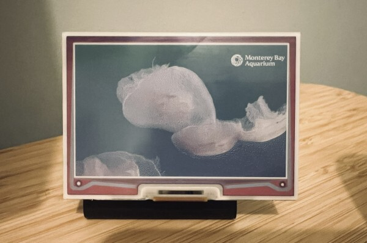

# `Inky Dash YouTube Live Image Feed`

Captures the latest frame from a live YouTube stream and prepares it for display on one of Pimoroni's line of Raspberry
Pi ePaper displays. Intended to be used in conjunction with the [Inky Dash](https://github.com/r-rayns/inky_dash)
image-feed mode.

## Output 🖼️

**Example output displaying on an Inky Impressions 4"**



## Setup 🛠️

1. Download this repository onto the device you wish to run it from.
2. If you have [Poetry](https://python-poetry.org/) installed, run `poetry install` to install the dependencies. If you
   do not have Poetry installed, you can install dependencies by creating a new Python virtual environment and running
   `pip install -r requirements.txt`.
3. Install the dependency `ffmpeg` using your package manager.
4. Create a `.env` file in the root of the project directory. For example:
   ```
   YOUTUBE_URL="https://www.youtube.com/watch?v=73k27SEQVTU"
   REFRESH_RATE_MINUTES=5
   DISPLAY_WIDTH=640
   DISPLAY_HEIGHT=400
   CROP=True
   CROP_LEFT=45
   CROP_TOP=0
   CROP_RIGHT=685
   CROP_BOTTOM=400
   ```
5. From the project root run; `poetry run python3 -m src.app` or if you are not using Poetry; `python3 -m src.app`.
6. A png image will be created in the root of the project directory called "latest_frame.png".
7. The image is updated, by default, every 10 minutes.
8. If you are using the `--server` flag with the default port, the image will be hosted
   at http://localhost:9143/latest_frame.png.

### Flags

- `--server`: Starts a basic HTTP server that hosts the generated image.
- `--port`: Port the server should listen on, **default 9143**.

### Env File

- YOUTUBE_URL: The URL of the YouTube video to capture.
- REFRESH_RATE_MINUTES: The period between fetching the latest frame from the stream. **Optional - default 10 minutes**
- DISPLAY_WIDTH: The width of the Inky display.
- DISPLAY_HEIGHT: The height of the Inky display.
- CROP: Whether to crop the image. **Optional**
- CROP_LEFT: The number of pixels to crop from the left.  **Required if CROP=True**
- CROP_TOP: The number of pixels to crop from the top.   **Required if CROP=True**
- CROP_RIGHT: The number of pixels to crop from the right.  **Required if CROP=True**
- CROP_BOTTOM: The number of pixels to crop from the bottom.   **Required if CROP=True**

Example file:

   ```
   YOUTUBE_URL="https://www.youtube.com/watch?v=73k27SEQVTU"
   REFRESH_RATE_MINUTES=5
   DISPLAY_WIDTH=640
   DISPLAY_HEIGHT=400
   CROP=True
   CROP_LEFT=45
   CROP_TOP=0
   CROP_RIGHT=685
   CROP_BOTTOM=400
   ```

### Running as a service

A systemd file can be used to run the image generator as a service.

1. Create a new file called `inky_yt_capture.service` in `/etc/systemd/system/`.

2. Copy the example below into the new file. `WorkingDirectory` points to the project directory. The `ExecStart` path
   should use the Python binary in your virtual environment to run `src/app.py`. Replace `your_username` with the
   correct
   username.

   ```
   [Unit]
   Description=Inky YouTube Capture
   After=network.target

   [Service]
   User=<your_username>
   EnvironmentFile=/etc/default/inky-yt-capture
   WorkingDirectory=/home/<your_username>/inky_yt_capture/
   ExecStart=/home/<your_username>/venv/inky-yt_capture/bin/python3 -m src.app --server
   Restart=always

   [Install]
   WantedBy=multi-user.target
   ```

3. Save the systemd service file.

4. Refresh systemd then enable and start the service

   ```
   sudo systemctl daemon-reload
   sudo systemctl enable inky_yt_capture
   sudo service inky_yt_capture start
   ```
