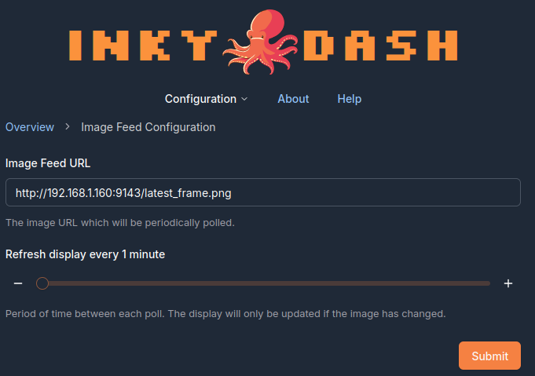

# `Inky Dash YouTube Live Image Feed`

Captures the latest frame from a YouTube live stream and prepares it for display on one of Pimoroni's line of Raspberry
Pi ePaper displays. Intended to be used in conjunction with the [Inky Dash](https://github.com/r-rayns/inky_dash)
image-feed mode.

## Output 🖼️

**Monterey Bay Aquarium's Jelly Cam displaying on an Inky Impressions 4"**


### Displaying on an Inky display

The captured frame will be saved as `latest_frame.png` at the project root. The image can then be hosted and displayed
on an Inky display using the Image Feed mode. If you are using the `--server` [flag](#flags), the image will be hosted
on localhost
under `/latest_frame.png`.

#### Example

If you are running on a local network then the URL may look like:

```bash
http://192.168.1.160:9143/latest_frame.png
```

Where `192.168.1.160` is the local IP address of the device running the service. The URL should then be set in the
"Image Feed Configuration" section of Inky Dash.



## Setup 🛠️

### 1. Download the project

Download this repository onto the device you wish to run it from. This does not have to be the same device that is
hosting [Inky Dash](https://github.com/r-rayns/inky_dash).

### 2. Install dependencies

Next install the project dependencies.

The best way to install dependencies is to create a new Python virtual environment:

```bash
# Create the virtual environment directory, if it doesn't already exist
mkdir ~/venv
# Create the virtual environment
python3 -m venv ~/venv/inky-yt-capture
# Activate the virtual environment
source ~/venv/inky-yt-capture/bin/activate
```

then run the following, from the project root:

```bash
pip install -r requirements.txt
```

### 3. Install `ffmpeg`

The project uses `ffmpeg` to capture the latest frame from the YouTube stream.

```bash
sudo apt install ffmpeg
```

### 4.Create a `.env` file in the project root

A `.env` file is used to configure the project, such as setting the YouTube stream URL.

Create a `.env` file in the root of the project directory. For example:

```bash
# Monterey Bay Aquarium Jelly Cam
YOUTUBE_URL="https://www.youtube.com/watch?v=73k27SEQVTU"
REFRESH_RATE_MINUTES=5
# Setup for a 4" Inky Impression
DISPLAY_WIDTH=640
DISPLAY_HEIGHT=400
CROP=True
CROP_LEFT=45
CROP_TOP=0
CROP_RIGHT=685
CROP_BOTTOM=400
```

See [below](#env-file) for a detailed description of the `.env` file.

## Running 🏃

To run the project go to the project root and execute:

```bash
# Running the project with both server and port flags
python3 -m src.app --server --port 9143
```

The recommended way to run this project is as a service. This ensures it starts automatically on boot and stays running
in the background as a managed process. To do that, follow these steps:

### 1. Crate a `.service` file

Change directories to:

```bash
cd /etc/systemd/system/
```

and create a new `.service` file:

```bash
touch inky_yt_capture.service
```

### 2. Edit the file

Copy the example below into the new file.

- `WorkingDirectory` points to the project directory.
- `ExecStart` path should use the Python binary in the virtual environment you set up, to run `src.app.py`.
- `your_username` should be replaced with the correct username.

*Consider what [flags](#flags) you might like to use for the `ExecStart` command. Here I use the `--server` flag to host
the output.*

```bash
[Unit]
Description=Inky YouTube Capture
After=network.target

[Service]
User=<your_username>
WorkingDirectory=/home/<your_username>/inky_yt_capture/
ExecStart=/home/<your_username>/venv/inky-yt_capture/bin/python3 -m src.app --server
Restart=always

[Install]
WantedBy=multi-user.target
```

Save the file.

### 3. Start the service

You'll now need to refresh the systemd daemon and enable the service:

```bash
# Refresh systemd so your new service is detected
sudo systemctl daemon-reload
# Enable your new service so it starts on boot
sudo systemctl enable inky_yt_capture
# Start your new service
sudo service inky_yt_capture start
```

### Flags

- `--server`: Starts a basic HTTP server that hosts the generated image.
- `--port`: Port the server should listen on, **default 9143**.

### Env File

- YOUTUBE_URL: The URL of the YouTube video to capture.
- REFRESH_RATE_MINUTES: The period between fetching the latest frame from the stream. **Optional - default 10 minutes**
  - Must be between 2 and 1440 minutes.
- DISPLAY_WIDTH: The width of the Inky display.
- DISPLAY_HEIGHT: The height of the Inky display.
- CROP: Whether to crop the image. **Optional**
- CROP_LEFT: The number of pixels to crop from the left.  **Required if CROP=True**
- CROP_TOP: The number of pixels to crop from the top.   **Required if CROP=True**
- CROP_RIGHT: The number of pixels to crop from the right.  **Required if CROP=True**
- CROP_BOTTOM: The number of pixels to crop from the bottom.   **Required if CROP=True**

Example file:

```
YOUTUBE_URL="https://www.youtube.com/watch?v=73k27SEQVTU"
REFRESH_RATE_MINUTES=5
DISPLAY_WIDTH=640
DISPLAY_HEIGHT=400
CROP=True
CROP_LEFT=45
CROP_TOP=0
CROP_RIGHT=685
CROP_BOTTOM=400
```

## Development 🧑‍💻

### Updating dependencies

Dependencies are managed using [Poetry](https://python-poetry.org/). The requirements.txt file has been generated using
Poetry export:

```bash
poetry export --without-hashes -f requirements.txt -o requirements.txt
```
